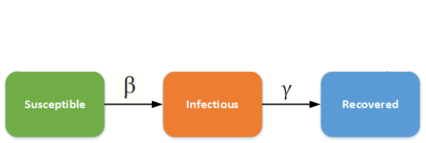

```{r setup, include=FALSE}
knitr::opts_chunk$set(echo = TRUE)
```
```{r include=FALSE}
library("shinySIR")
```
This notebook provides a simple interactive Ordinary Differential Equation(ODE) model for the progression of an infectious disease. The model we use is the Susceptible-Infected-Recovered(SIR).

The following multi-state diagram illustrates diagrammatically the SIR.



##The Susceptible- Infected-Recovered(SIR).

The SIR is a widely used deterministic compartmental model for infectious disease progression in continuous time. The SIR relies on solving the system of differential equations below representing the analytic trajectory the disease 'system'


\begin{align*}
\frac{dS}{dt} &= -\beta S I\\
\frac{dI}{dt} &= \beta S I - \gamma I\\
\frac{dR}{dt} &=  \gamma I.
\end{align*}

Where S is the susceptible population, I is the infected population, R is the recovered population. \beta is the transmission rate, and \gamma is the recovery rate --1/\gamma, therefore, becomes the infectious period .ie the time you are sick enough to transmit the disease.

###The Basic Repoductive Number $R_0$

Epidemiologists often measure the contagiousness of a disease using a measure called the basic reproductive number($R_0$). $R_0$ represents the mean number of additional infections created by one infectious individual in a susceptible population .ie a case multiplier. According to the latest available literature, the $R_0$ for COVID-19 is between 2 and 2.75. Mathematically $R_0$ can be expressed as:

$$R_0 = \beta N / \gamma$$
Where N is the total population i.e N = S + R + I.


####The Model's Assumptions

* Susceptible individuals (S) become infected and move into the infected class (I).
* After a while, infected individuals recover and move into the recovered (or immune) class (R).
* Once immune, they remain so for life (i.e. they do not leave the improved class). 

###SIR in SA --What are the intial Conditions? 

We now simulate the SIR model using 'South Africa's' parameters(mathematician's call this initial conditions). We assume the following initial conditions(these are somewhat subjective):

* Susceptible population is set at S= 10000 0000
* Recovered Population is initialised at R = 4 (DoH data)
* Infected population is initialised at I = 1000 (DoH data as at 25/03/2020 with some margin).

Users can toggle the $R_0$ parameter and the infectious period $1/\gamma$ to create a better understanding of the disease progression dynamics as these parameters change. 

**Note** Given too little data on South Africa's cases to calibrate \gamma in particular correctly. S is also subjective --  is it correct to assume the entire population of approximately 59 million as susceptible? Guidence on $R_0$ as stated before is between 2 and 2.75.


```{r}
run_shiny(model = "SIR",ics = c(S = 1000000, I = 1000, R = 4),parm0 = c(R0 = 2.75, Ip = 8),parm_names = c("Base Reproductive Number(multipler per case)", "Infectious period(days)"), parm_min = c(R0 = 0, Ip = 1), parm_max = c(R0 = 20, Ip = 30),labels = c("Susceptible", "Infected", "Recovered"),legend_title ="Population Disease Class")
```


